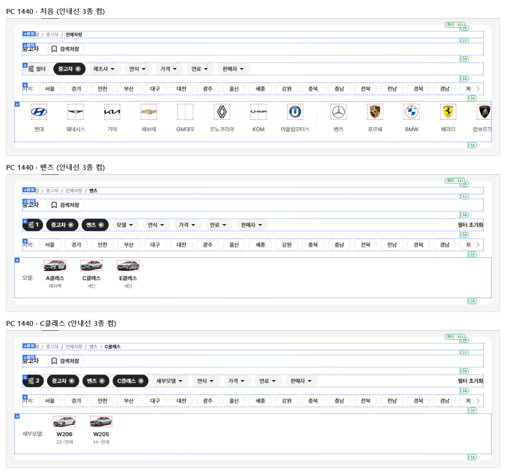
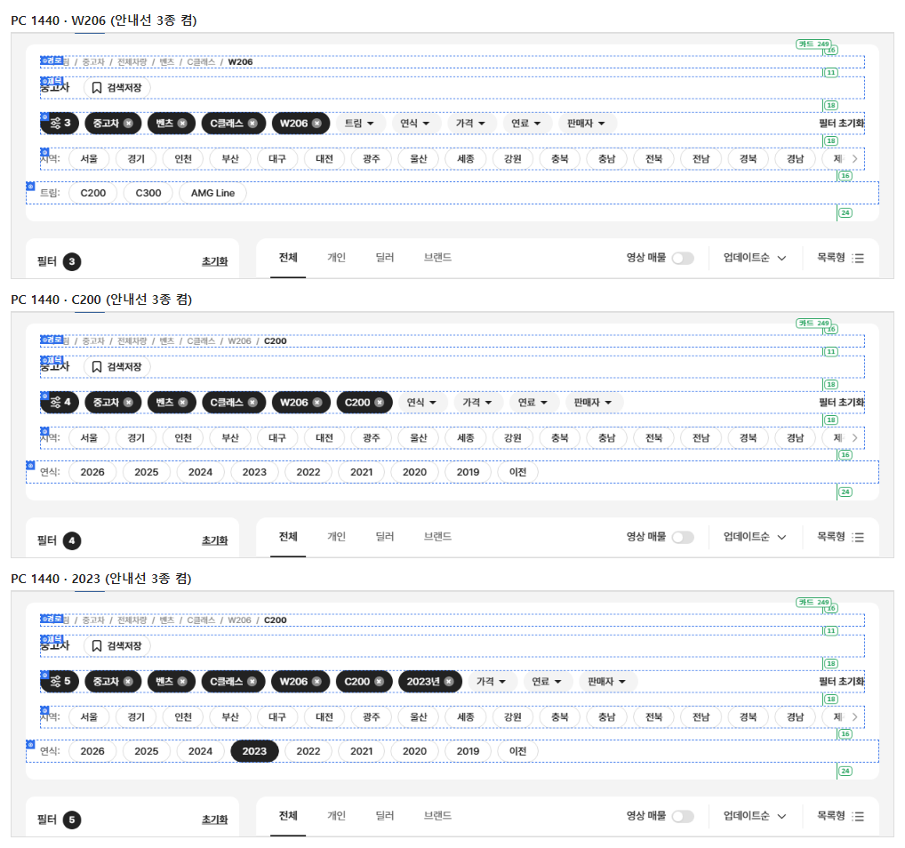
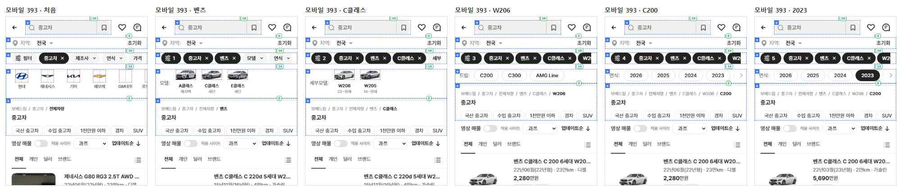
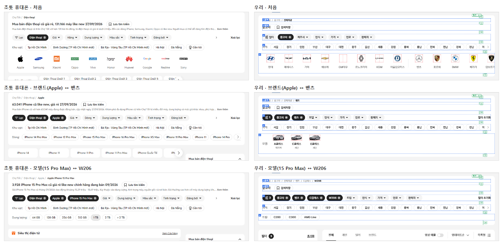
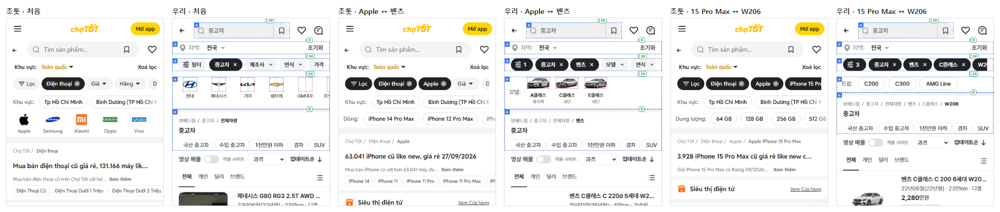
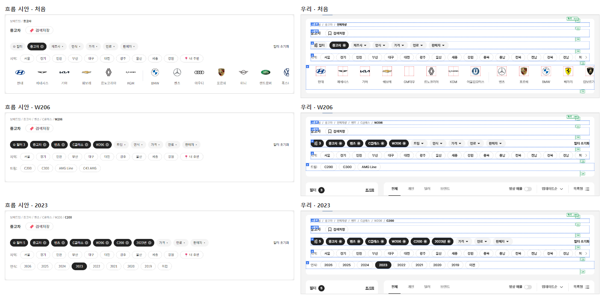
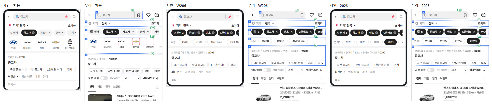
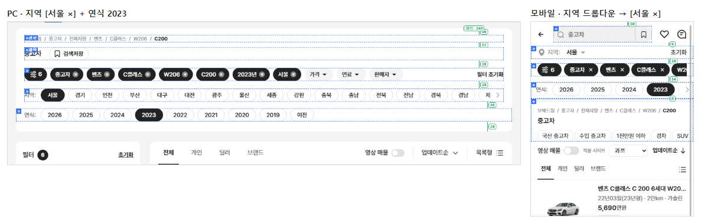

# PR #93 QF-106 상단 구조 고정 + 안정성 매뉴얼 v1.1

## 1. 한 줄 요약
과쯔 모드 PC·모바일 상단을 매뉴얼 v1.1(`docs/stable-top-manual.md`)대로 층을 고정했습니다. 제목은 "중고차"로 고정했고, ④ 퀵필터 자리는 닫히지 않습니다(제조사 → 모델 → 세부모델 → 트림 → 연식). 앞으로 고르며 나갈 때 높이 변화는 이미지 줄 → 알약 줄 1회뿐입니다. `npm run check:stability`는 plain·card × 4개 크기 모두 통과했습니다.

## 2. 기본 정보
| 항목 | 내용 |
|---|---|
| 과제 ID | QF-106(이전 QF-106·QF-107을 합친 지시. 이전 PR·브랜치 없음) |
| 브랜치 | `feat/qf-106-stable-top`(main `5133147`에서 시작) |
| 커밋 | `04cecf8` · 보고서 커밋(이 파일) |
| PR | https://github.com/bobaekimboae/bobaedream/pull/93 |
| 상태 | 병합·배포(배포 v 값은 채팅 보고·노션에 적음) |
| 이번 병합으로 main에 함께 들어간 과제 | QF-106 |

## 3. 한 일
- **제목**: 들어온 카테고리 이름만 씁니다(중고차 / 국산 중고차 / 수입 중고차). 대수·날짜·고른 조건은 넣지 않습니다. 브라우저 탭 제목(`<title>`)은 그대로입니다. 점검용으로 대수는 화면에 안 보이는 `data-count`에 둡니다.
- **PC 상단 카드**: ① 경로 18 → 11 → 제목 줄 32 → 18 → ② 칩 줄 32 → 18 → ③ 지역 알약 줄 32(항상, "지역:" + 17개 시도 + "내 주변") → 16 → ④ 퀵필터 자리(항상) → 카드 끝 16(이미지 줄) / 24(알약 줄). 카드 높이는 plain 311 · 알약 249 두 값뿐입니다(card 모드 281 · 249).
- **모바일**: ① 검색바 40(화면 위 10) → 8 → ② "지역: 전국 ▾" 32 → 10 → ③ 칩 32(사이 4) → 14 → ④(위 2 + 칸 + 아래 6, 첫 칸·이름표 x = 첫 칩 − 4) → ⑤ 회색 띠 8 · 경로 · 제목 · 관련 검색어 알약(28). 모바일에는 지역 알약 줄이 없고, 드롭다운에서 고르면 칩 줄에 [서울 ×]가 생깁니다.
- **④ 자리**: 트림 뒤에는 연식 알약 줄(2026…2019 · 이전)이 옵니다. 누르면 [2023년 ×], 다른 연식을 누르면 바뀌고, 다시 누르면 풀리며 줄은 그대로입니다. 이름표는 "모델:" "세부모델:" "트림:" "연식:". 칩 줄에는 다음 단계 자리 칩(제조사▾ → 모델▾ → 세부모델▾ → 트림▾ → 연식▾)이 있고, "필터 초기화"는 1번 상태(들어온 카테고리 유지)로 돌아갑니다.
- **알약 규격**: 지역·트림·연식 알약 1px #DADADA · 14/20 500, 고르면 #222 흰 글자. 모델·세부모델 칸은 높이 고정(PC 102 · 모바일 74), 이름 1줄·보조 글자 1줄 말줄임.
- **&debug=1 체크 박스 3종**: "로고·이미지 칸"(빨강, 이전 "로고 칸 안내선" 대체) · "층 상자"(파랑 점선 + 층 번호) · "간격 숫자"(매뉴얼과 같으면 초록, 다르면 빨강 + PC 카드 높이). 위반은 빨간 점 8px + 이유. 화면 위 겹층이라 레이아웃은 바뀌지 않고, 켠 상태는 브라우저에 기억됩니다.
- **점검**: `npm run check:stability` 추가(`check:rail-vertical` 대체). check:models·logos·top·hybrid·diff:bbm:flow를 새 구조(고정 제목, 지역 줄, 연식 줄, 알약 규격)에 맞췄습니다.

## 4. 원본과 비교
### check:stability 단계 × 크기(PC 카드 높이 · 모바일 ④ 상자 높이 · ④ 줄)
| 단계 | PC 1440 | PC 1280 | 모바일 393 | 모바일 360 |
|---|---|---|---|---|
| 처음 | O 311 제조사 | O 311 제조사 | O 82 제조사 | O 82 제조사 |
| 벤츠 | O 311 모델 | O 311 모델 | O 82 모델 | O 82 모델 |
| C클래스 | O 311 세부모델 | O 311 세부모델 | O 82 세부모델 | O 82 세부모델 |
| W206 | O 249 트림 | O 249 트림 | O 40 트림 | O 40 트림 |
| C200 | O 249 연식 | O 249 연식 | O 40 연식 | O 40 연식 |
| 2023 | O 249 연식 | O 249 연식 | O 40 연식 | O 40 연식 |
| 연식 해제 | O 249 연식 | O 249 연식 | O 40 연식 | O 40 연식 |
| 필터 초기화 | O 311 제조사 | O 311 제조사 | O 82 제조사 | O 82 제조사 |

card 모드도 모두 통과(PC 281 ↔ 249, 모바일 80 ↔ 40). 모든 크기에서 높이 변화 1회 · 이미지 로딩 전후 층 위치 차이 0 · 넘침 0 · 스크롤바 보임 0 · 줄바꿈 0 · 콘솔 오류 0.

### 원본(bbmuseum) 대조 — 매뉴얼 때문에 달라진 영역
| 영역 | 작업 전 | 작업 후 | 이유 |
|---|---:|---:|---|
| 모바일 첫 화면 헤더(검색) | ≤3% | 19.7%(56 → 50) | 매뉴얼 ① 검색바 40 · 위 10 |
| 모바일 지역 줄 | ≤3% | 33.7%(44 → 32) | 매뉴얼 ② 32 |
| 모바일 칩 줄(첫 화면·고정 칩) | ≤3% | 53.7%(52 → 32) | 매뉴얼 ③ 32, 위아래 간격은 층 사이 간격으로 |
| diff:bbm:flow 모바일 칩 단계 5곳 | ≤3% | 53.7~75.2% | 같은 이유(칩 줄 상자 높이) |
| 그 밖의 영역(PC 전부 포함) | ≤3% | ≤3%(최대 2.8%) | — |

### 동작 점검
| 항목 | 결과 |
|---|---|
| PC 지역 "서울" 누름 → [서울 ×] · 알약 #222 · 필터 칩 검정 "1" · 카드 높이 311 그대로 | 통과 |
| PC "서울" 다시 누름 → 해제 · 필터 칩 회색 | 통과 |
| PC "내 주변" → 안내 토스트 | 통과 |
| 모바일 지역 드롭다운 → 서울 → [서울 ×] · 지역 줄 "서울" · 지역 알약 줄 없음 | 통과 |
| 모바일 [서울 ×] → 전국 | 통과 |
| 연식 2023 → [2023년 ×] → 2021 로 바뀜 → 다시 누르면 해제 · 줄 유지(PC·모바일) | 통과 |
| 조건 있으면 "필터 N" 칩 #222 | 통과 |

## 5. 검증
| 점검 | 결과 |
|---|---|
| `check:stability` | plain 4크기 × 8단계 모두 통과 · card 모두 통과 |
| `verify:qf` | 통과(runtime 28개 보호 파일 · tsc · vite build) |
| `check:models` | PC 1440 23/23 · PC 1280 23/23 · 모바일 393 19/19 |
| `check:logos` · `check:top` · `check:hybrid` · `check:sidebar` | 21/21 · 21/21 · 20/20 · 31/31 |
| `diff:bbm` / `diff:bbm:flow` | 위 표의 모바일 상단 3개 영역 외 ≤3% · flow 274/274 |
| `regress:modes` | 초톳·동처띠 PC·모바일 10개 0% (과쯔 모바일 21.6%는 이번 변경) |
| 콘솔 오류 | PC 0 · 모바일 0 |
| `measure:qf` | 레일 PC 102 · 모바일 82(위 2/아래 6) · 카드 84×102 / 64×74 · 이미지 56×28 · 넘침 없음 |

## 6. 원본·매뉴얼과 다르게 남긴 것과 이유
- **모바일 첫 화면(유형 줄) ④ 높이 99.6**: 매뉴얼 흐름은 "중고차"를 고른 뒤부터라 유형 줄(원본 모양)은 그대로 두었습니다. 디버그 "층 상자"를 켜면 "높이 99.6 ≠ 82 (유형 줄)"로 표시됩니다.
- **모바일 상단 3개 영역 원본 대조 3% 초과**: 매뉴얼 수치(검색 40 · 지역 32 · 칩 32)를 따른 결과입니다.
- **"필터 N" 칩**: 1단계([중고차 ×]만 있을 때)는 회색입니다. 카테고리는 조건 수에 세지 않는 기존 규칙을 유지했습니다.
- **지역 값**: PC 알약은 좌측 필터와 같은 "지역"(1개 선택), 모바일은 기존 지역 드롭다운 값을 씁니다.
- **관련 검색어 "경차"·"하이브리드"**: 차급 "경형", 연료 "가솔린 하이브리드"로 연결했습니다.
- **초톳 비교 단계**: 초톳 휴대폰 페이지는 브랜드 → 모델 → 용량이라, 우리 처음 · 벤츠 · W206(알약 줄 전환)과 맞대었습니다.

## 7. 못 한 것 · 다음에 할 것
- 모바일 유형 줄(첫 화면)도 82 칸 규격으로 맞출지 결정 필요(원본 대조와 충돌).
- 지역 알약 줄에 "내 주변"은 안내 토스트만 띄웁니다(정식 서비스 기능).

## 8. 확인 링크
- 모바일: https://bobaekimboae.github.io/bobaedream/?qf=guazi&v=<커밋>
- PC: https://bobaekimboae.github.io/bobaedream/?qf=guazi&v=<커밋>&pc=1
- 안내선: 위 주소 끝에 `&debug=1` → 오른쪽 아래 체크 박스 3개
