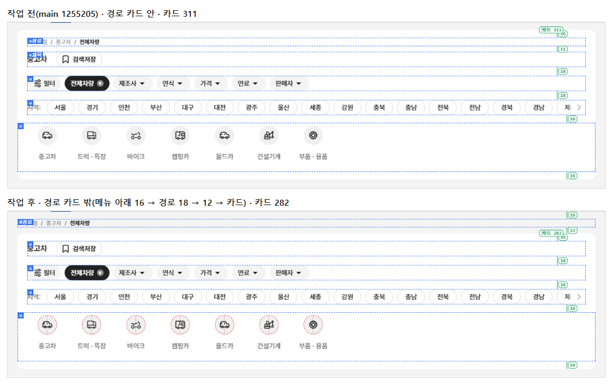
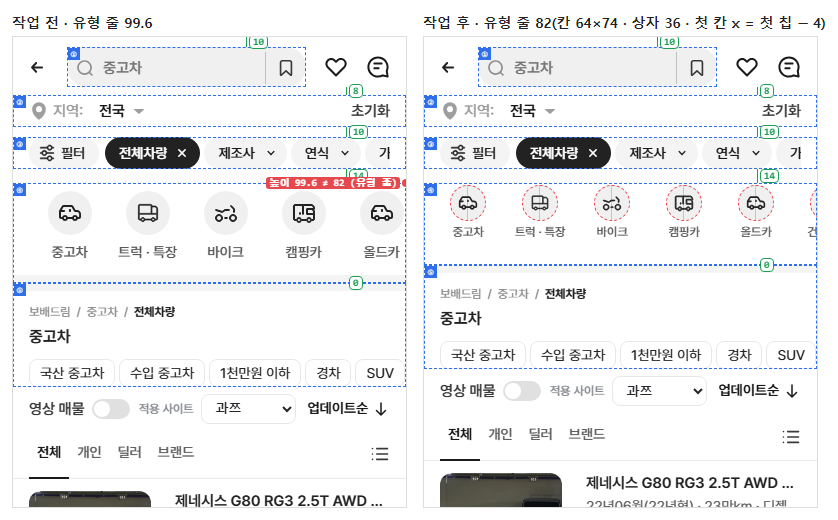
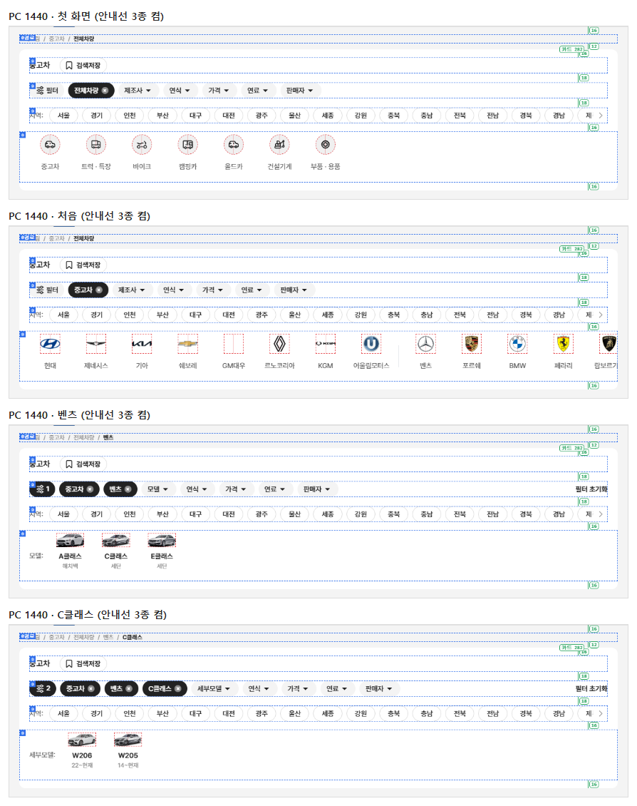
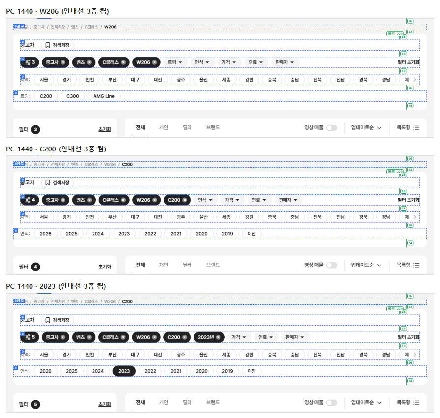
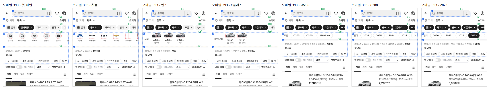
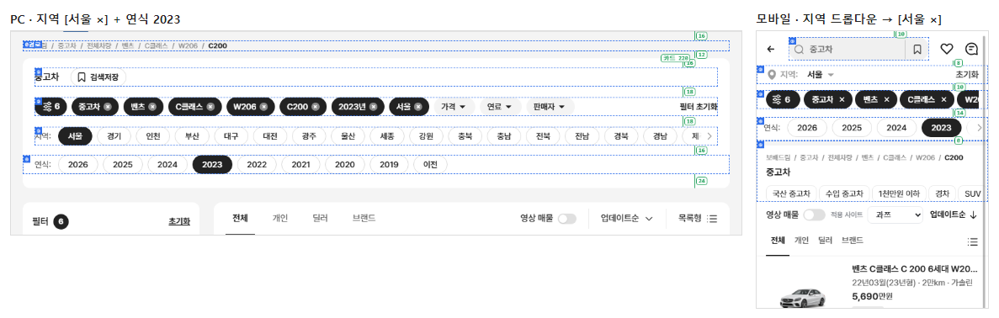

# PR #94 QF-106b 상단 구조 보완 — 경로 카드 밖 분리 · 모바일 유형 줄 82 · 원본 대조 기준 교체

## 1. 한 줄 요약
매뉴얼 v1.3에 맞춰 PC 경로를 상단 카드 밖(회색 바탕 위)으로 옮겨 카드를 29 줄였고(282/220), 모바일 첫 화면 유형 줄을 ④ 이미지 줄 규격 82로 맞춰 모바일 ④ 높이가 82/40 두 값만 남았습니다. 원본 대조(diff:bbm·flow)는 이번 결과를 새 기준으로 저장해 비교하고, 이전 원본 캡처는 보관했습니다.

## 2. 기본 정보
| 항목 | 내용 |
|---|---|
| 과제 ID | QF-106b |
| 브랜치 | `feat/qf-106b-top-fix`(main `1255205`에서 시작) |
| 커밋 | `0b0fff9` · 보고서 커밋(이 파일) |
| PR | https://github.com/bobaekimboae/bobaedream/pull/94 |
| 상태 | 병합·배포(배포 v 값은 채팅 보고·노션에 적음) |
| 이번 병합으로 main에 함께 들어간 과제 | QF-106b |

## 3. 한 일
- **PC 경로 분리**: 경로를 상단 카드 밖 회색 바탕 위로 옮겼습니다. 상단 메뉴 아래 16 → 경로 18(12/18 #8C8C8C, 마지막 700 #222, 왼쪽 선 = 카드 왼쪽 선) → 12 → 카드. 카드는 제목 "중고차" + 검색저장 줄부터 시작합니다(카드 안쪽 위 16, 제목 줄 → 칩 줄 18).
- **카드 높이**: plain 311 → 282, 알약 줄 249 → 220(card 모양 281 → 252 / 220). 여전히 두 값만 있습니다.
- **모바일 첫 화면 유형 줄**: 칸 64×74 · 피치 72 · 상자 36(칸 위 0) · 이름 12/18 500 #595959 폭 56 · 줄 상자 위 2 + 74 + 아래 6 = 82 · 첫 칸 x = 첫 칩 − 4. 회색 띠는 ⑤가 맡습니다. 모바일은 경로 위치 그대로입니다.
- **원본 대조 기준 교체**: `diff:bbm`·`diff:bbm:flow`의 기본 비교 기준을 `reports/baseline/`(이번 결과 화면 조각 50개 + flow 116개, 동작 값 포함)으로 바꿨습니다. 이전 기준(개발 시안 원본 캡처)은 `reports/baseline-archive/2026-09-27-bbmuseum/`에 보관했습니다. `-- --origin`을 붙이면 원본과 바로 비교하고, `-- --save-baseline`을 붙이면 기준을 다시 저장합니다(`scripts/diff-baseline.mjs`).
- **점검·안내선**: check:stability에 0층 경로(메뉴 아래 16 · 카드까지 12 · 왼쪽 선 · 카드 안에 경로 없음)와 "첫 화면" 단계(PC 102 · 모바일 82 줄)를 넣었습니다. check:top 줄 위치를 새 값으로 바꿨습니다. &debug=1 "층 상자"에 "0경로" 상자와 간격 숫자, "로고·이미지 칸"에 유형 줄 아이콘 상자를 넣었습니다.
- **문서**: `docs/stable-top-manual.md` v1.3, `docs/quick-filter-spec.md` QF-106b 규칙.

## 4. 원본과 비교
### 작업 전 → 후
| 항목 | 작업 전(main 1255205) | 작업 후 |
|---|---|---|
| PC 경로 위치 | 카드 안(카드 위 16) | 카드 밖(메뉴 아래 16, 카드까지 12) |
| PC 카드 높이 plain | 311 / 249 | 282 / 220 |
| PC 카드 높이 card | 281 / 249 | 252 / 220 |
| 모바일 ④ 첫 화면 | 99.6(유형 줄 원래 모양) | 82 |
| 모바일 ④ 높이 종류 | 99.6 · 82 · 40 | 82 · 40 |

### check:stability 단계 × 크기(PC 카드 높이 · 모바일 ④ 높이)
| 단계 | PC 1440 | PC 1280 | 모바일 393 | 모바일 360 |
|---|---|---|---|---|
| 첫 화면 | O 282 유형 | O 282 유형 | O 82 유형 | O 82 유형 |
| 처음 | O 282 제조사 | O 282 제조사 | O 82 제조사 | O 82 제조사 |
| 벤츠 | O 282 모델 | O 282 모델 | O 82 모델 | O 82 모델 |
| C클래스 | O 282 세부모델 | O 282 세부모델 | O 82 세부모델 | O 82 세부모델 |
| W206 | O 220 트림 | O 220 트림 | O 40 트림 | O 40 트림 |
| C200 | O 220 연식 | O 220 연식 | O 40 연식 | O 40 연식 |
| 2023 | O 220 연식 | O 220 연식 | O 40 연식 | O 40 연식 |
| 연식 해제 | O 220 연식 | O 220 연식 | O 40 연식 | O 40 연식 |
| 필터 초기화 | O 282 제조사 | O 282 제조사 | O 82 제조사 | O 82 제조사 |

card 모양도 모두 통과(PC 252 ↔ 220, 모바일 80 ↔ 40, 첫 화면은 두 모양 공통 유형 줄 282 · 82).

### 원본 대조(새 기준)
| 점검 | 영역 | 최대 차이 |
|---|---:|---:|
| diff:bbm | 25개 | 0% |
| diff:bbm:flow | 41개 · 동작 274/274 | 0% |

## 5. 검증
| 점검 | 결과 |
|---|---|
| `check:stability` | plain·card × PC 1440·1280 · 모바일 393·360 × 9단계 모두 통과(경로 위치 포함) |
| `verify:qf` | 통과(runtime 28개 보호 파일 · tsc · vite build) |
| `check:models` | 23/23 · 23/23 · 19/19 |
| `check:logos` · `check:top` · `check:hybrid` · `check:sidebar` | 21/21 · 21/21 · 20/20 · 31/31 |
| `regress:modes` | 초톳·동처띠 PC·모바일 10개 0% |
| 콘솔 오류 | PC 0 · 모바일 0 |

## 6. 원본·매뉴얼과 다르게 남긴 것과 이유
- **card 모양 첫 화면**: 유형 줄은 두 모양 공통이라 card 모양에서도 plain 규격(PC 102 · 모바일 82)으로 점검합니다. card 모양의 카드 높이는 첫 화면 282 → "중고차" 고른 뒤 252로 한 번 바뀝니다(비교용 모양이라 그대로 둠).
- **PC 칩 줄 픽셀 대조**: flow의 PC 칩 줄은 전처럼 "초톳 기준"(check:top·diff:chotot-top)으로 둡니다.

## 7. 못 한 것 · 다음에 할 것
- 매뉴얼 v1.3의 새 항목(로고 크기 3단계 82.5% · 91% · 100%, 이름 폭 76·56 고정, 제조사 줄 10개 + "전체 브랜드")은 이번 지시 범위(1~3번)에 없어 문서만 갱신하고 적용하지 않았습니다.

## 8. 확인 링크
- 모바일: https://bobaekimboae.github.io/bobaedream/?qf=guazi&v=<커밋>
- PC: https://bobaekimboae.github.io/bobaedream/?qf=guazi&v=<커밋>&pc=1
- 안내선: 주소 끝에 `&debug=1`
