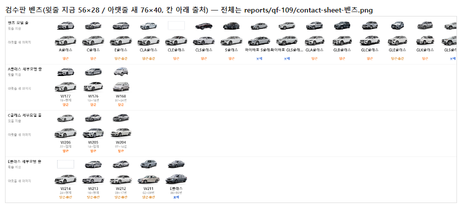
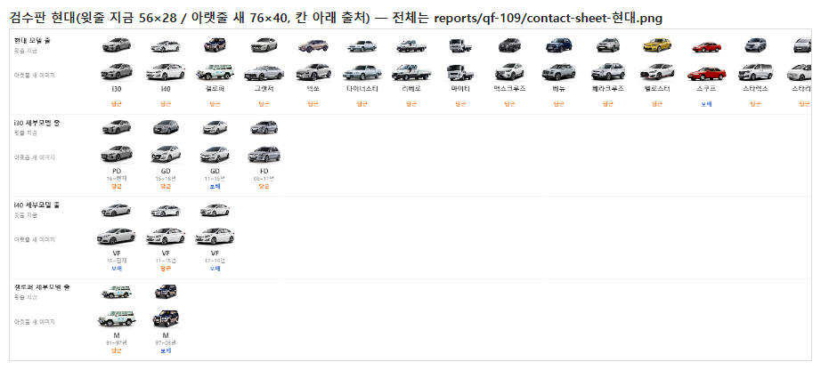
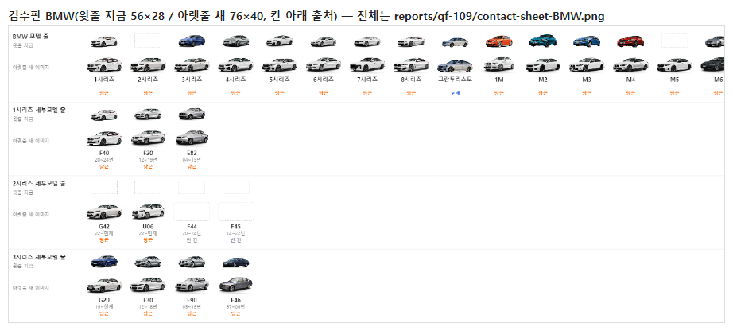
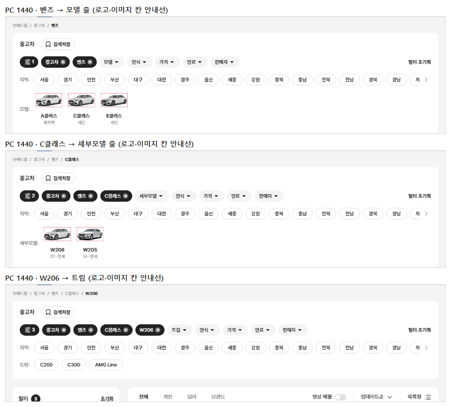
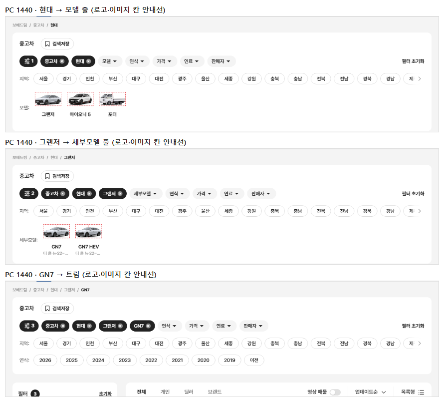
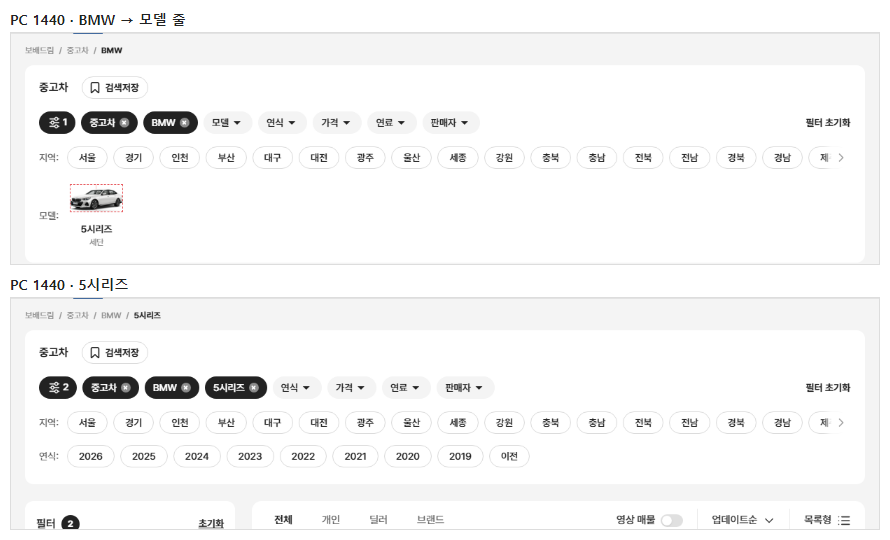
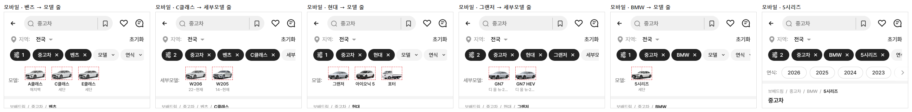

# PR #95 QF-109 모델·세부모델 이미지를 당근 이미지로 전체 교체 · 코드 정렬 부품 · 이미지 슬롯 76×40

## 1. 한 줄 요약
과쯔 plain 모델·세부모델 줄 이미지를 당근 이미지 우선으로 바꾸고, 출처와 관계없이 코드 정렬 부품 하나(차 폭 224 · 바닥선 111 · 그림자 고정)로 맞췄습니다. 세부모델 449칸 중 당근 361(80%) · 보배 59 · 빈 칸 29이고, 이미지 영역은 PC 76×40 · 모바일 56×36입니다. 6번 점검이 모두 통과해 병합·배포했습니다.

## 2. 기본 정보
| 항목 | 내용 |
|---|---|
| 과제 ID | QF-109 |
| 브랜치 | `feat/qf-109-dg-images-all`(main `efe4db2`에서 시작) |
| 커밋 | `416a2d1` · 보고서 커밋(이 파일) |
| PR | https://github.com/bobaekimboae/bobaedream/pull/95 |
| 상태 | 병합·배포(배포 v 값은 채팅 보고·노션에 적음) |
| 이번 병합으로 main에 함께 들어간 과제 | QF-109 |

## 3. 한 일
- **당근 받기**(`scripts/daangn-fetch.mjs`): 9개 브랜드 시리즈·subseries 698개와 이미지를 1초에 1번씩 받았습니다(실패 0). 원본은 `tmp/daangn-cache/`에만 두고 커밋하지 않습니다(`.gitignore`에 `tmp/` 추가).
  - 브랜드 이름 대응표는 스크립트의 `BRAND_MAP`에 있습니다. 쉐보레(국산)·르노코리아(삼성)·KG모빌리티(쌍용)는 시안 카탈로그에 없어 표에만 넣었습니다.
- **세대 맞춤표**(`scripts/model-images-dg.mjs` → `src/prototype/data/model-image-match.json`, `reports/qf-109/match.csv`).
  - 연결 근거는 코드 일치 → 이름 일치 → 세대 번호 → 세대 밀어 맞춤 → 파생형 → 단일 일치 순서로 봅니다. 확실하지 않으면 연결하지 않습니다.
  - 틀린 연결을 막는 장치를 넣었습니다. 코드 일치를 이름 일치보다 먼저 봅니다("더 뉴 그랜저"·IG ↔ "더 뉴그랜저IG", 최신 "더 뉴그랜저" 아님). 같은 이름이 여러 세대에 있으면 이름으로 연결하지 않습니다. 이름이 다른 세부모델이 같은 당근 칸을 가져가면 이름이 정확히 같은 쪽만 남깁니다. 당근 목록 순서와 연식 순서가 반대면 "중간"으로 표시합니다.
- **코드 정렬 부품**(`scripts/image-normalize.mjs`): 흰 배경 제거 → 알파 16 이하 여백 자르기 → 228×120. 차 폭 224, 바닥선 111, 높이 100 제한, 키우지 않음, 그림자 220×12(14%→0%)를 코드로 그립니다. 좌우 반전·색 변경은 없습니다.
- **화면**(`qf-model-images.css`).
  - PC: 이미지 영역 76×40(칸 위 6, 바닥 46 = 로고 상자 바닥), 이름 칸 위 60 14/21 600 폭 76, 보조 글자 81 12/16.
  - 모바일: 이미지 영역 56×36, 이름 38, 보조 글자 56 11/14.
  - 빈 칸은 같은 영역에 1px 점선 #DADADA, 모서리 6입니다.
  - 모델 대표 이미지는 최신 세부모델의 당근 이미지입니다.
- **경로**: "전체차량" 단계를 뺐습니다(보배드림 / 중고차 / 벤츠 …, "중고차"를 누르면 제조사가 풀림).
- **점검·문서**: `npm run check:model-images`를 추가했고, check:models·top을 새 규격으로 바꿨습니다. 매뉴얼 v1.4, `docs/model-image-spec.md`, quick-filter-spec, change-log CH-0102~0106도 갱신했습니다.

## 4. 원본과 비교
### 브랜드별(모델 = 모델 줄 대표 칸, 세부 = 세부모델 칸)
| 브랜드 | 모델 칸 | 당근 / 보배 / 빈 칸 | 세부모델 칸 | 당근 / 보배 / 빈 칸 | 확신도 중간 | 확대한 칸 |
|---|---:|---|---:|---|---:|---:|
| 벤츠 | 38 | 29 / 6 / 3 | 67 | 54 / 9 / 4 | 12 | 0 |
| BMW | 37 | 30 / 3 / 4 | 82 | 69 / 5 / 8 | 6 | 0 |
| 현대 | 42 | 36 / 5 / 1 | 126 | 103 / 19 / 4 | 0 | 0 |
| 기아 | 34 | 32 / 2 / 0 | 107 | 86 / 17 / 4 | 0 | 0 |
| 포르쉐 | 9 | 8 / 1 / 0 | 22 | 18 / 2 / 2 | 1 | 0 |
| 페라리 | 21 | 17 / 2 / 2 | 21 | 17 / 2 / 2 | 0 | 0 |
| 람보르기니 | 6 | 5 / 1 / 0 | 6 | 5 / 1 / 0 | 0 | 0 |
| 벤틀리 | 5 | 3 / 2 / 0 | 9 | 3 / 4 / 2 | 0 | 0 |
| 롤스로이스 | 7 | 5 / 0 / 2 | 9 | 6 / 0 / 3 | 1 | 0 |
| **합계** | **199** | **165 / 22 / 12** | **449** | **361 / 59 / 29** | **20** | **0** |

작업 전 세부모델은 보배 322 · 당근 29 · 빈 칸 98이었습니다. 높이 100 제한이 걸린 이미지는 291개(차 비율이 2.24보다 높음)입니다.

### 보배 이미지가 섞인 줄(19줄)
벤츠 E클래스 당근 4·보배 1 · SL클래스 3·1 / 현대 i30 3·1 · i40 1·2 · 갤로퍼 1·1 · 그랜저 11·1 · 벨로스터 3·1 · 쏘나타 13·1 · 아반떼 9·3 · 제네시스 3·1 · 투스카니 1·1 / 기아 K3 3·1(빈 1) · K5 5·5 · K7 7·1 · 모닝 4·2 · 스포티지 7·1 · 쏘렌토 6·2 · 카니발 4·1(빈 2) · 프라이드 1·1

### 확신도 "중간"(연결했지만 따로 확인 필요, 20칸)
| 브랜드 | 모델 | 보배 코드·연식 | 당근 | 규칙 |
|---|---|---|---|---|
| 벤츠 | E클래스 | W214 · W213 · W212 · W211 | E클래스(6·5·4·3세대) | 세대 밀어 맞춤(보배 번호 11~8) |
| 벤츠 | GLE클래스 | W167 · W166 | GLE클래스(4·3세대) | 세대 밀어 맞춤(ML 계보 번호) |
| 벤츠 | CLA클래스 | C118 · C117 | CLA클래스(2세대) · CLA클래스 | 당근에 더 새 3세대 있음 · 세대 없는 이름 = 1세대 |
| 벤츠 | GLA · GLC · AMG GT · 스프린터 | X156 · X253 · C190 · W903 | 세대 없는 이름 | 세대 없는 이름 = 1세대 |
| BMW | 8시리즈 · M2 · M4 · X1 · X2 · X4 | E31 · F87 · F82 · E84 · F39 · F26 | 세대 없는 이름 | 세대 없는 이름 = 1세대 |
| 포르쉐 | 파나메라 | 970 | 파나메라 | 세대 없는 이름 = 1세대 |
| 롤스로이스 | 고스트 | 10~20년 | 고스트 | 세대 없는 이름 = 1세대 |

전체 검수판: `reports/qf-109/contact-sheet-{브랜드}.png`(9장). 윗줄은 지금, 아랫줄은 새 이미지이고 칸 아래에 출처(당근 · 당근·중간 · 보배 · 빈 칸)를 적었습니다.

## 5. 검증
| 점검 | 결과 |
|---|---|
| `check:model-images`(새) | 15/15 — 파일 420개 228×120 · 바닥선 111±1 · 폭 224±1(높이 제한 291은 높이 100±1) · 가운데 ±1 · 그림자 표본 ±3, 화면 PC 76×40·모바일 56×36, 이름 60·38, 보조 81·56, **제조사 로고 상자 바닥 = 모델 이미지 영역 바닥(PC 46·46, 모바일 36·36, 차이 0)** |
| `check:stability` | plain·card × PC 1440·1280 · 모바일 393·360 모두 통과 |
| `check:models` | 23/23 · 23/23 · 19/19(이미지 영역 76×40 · 56×36으로 갱신) |
| `check:logos` · `check:top` · `check:hybrid` · `check:sidebar` | 21/21 · 21/21 · 20/20 · 31/31 |
| `verify:qf` | 통과 |
| `regress:modes` | 초톳·동처띠 10개 0% |
| `diff:bbm` · `diff:bbm:flow`(QF-106b 기준) | 모든 영역 3% 이하 |
| 콘솔 오류 | PC 0 · 모바일 0 |

## 6. 지시와 다르게 남긴 것과 이유
- **흐름 캡처 BMW**: 샘플 매물에 BMW는 5시리즈만 있어(퀵필터는 매물 1대 이상인 모델만 보임) "3시리즈 → G20" 대신 "BMW → 5시리즈"로 찍었습니다. 5시리즈는 세부모델 칸이 샘플에 없어 트림·연식 줄로 넘어갑니다.
- **로고 바닥선 = 차 바닥선**: 칸 기준 이미지 영역 바닥(46·36)을 로고 상자 바닥과 같게 맞췄습니다(차이 0). 차 그림 자체의 아래 끝은 규격대로 228×120의 y 111이라, 영역 바닥보다 PC 3px·모바일 약 2px 위에 있습니다(아래는 그림자 자리).
- **색·각도**: 색은 바꾸지 않는 원칙이라 원본 색 그대로 두었습니다. 진한 색·유채색(평균 밝기 80 미만 또는 채도 0.35 초과)은 49칸이고, 그중 당근이 30칸입니다(페라리 대부분, 벤츠 S클래스 W220·W140, BMW M5 F10·M6 F12 등).
- **파생형**: BMW 2시리즈 그란쿠페 F44 · 액티브 투어러 F45는 당근에 같은 세대가 없어 빈 칸입니다(보배 이미지도 없음). 전에는 쿠페 세대 번호로 잘못 연결될 수 있던 자리입니다.
- **연결하지 않은 것**: 아반떼 "더 뉴 아반떼"(13~15년, 보배 코드 AD)는 보배 이미지를 씁니다. K5·쏘렌토·카니발의 "K5 3세대"처럼 당근 이름이 "신형 K5(DL3)"로 다른 것, K3 "더 뉴 K3"처럼 이름이 여러 세대에 겹치는 것도 연결하지 않았습니다.
- 검수판 PNG 9장(0.2~2.3MB)은 지시한 결과물이라 500KB 제한(보고 캡처용)과 별도로 `reports/qf-109/`에 두었습니다.

## 7. 못 한 것 · 다음에 할 것
- 확신도 "중간" 20칸은 사람 눈으로 한 번 확인이 필요합니다(특히 E클래스·GLE 번호 밀어 맞춤).
- 빈 칸 29칸은 당근·보배 모두 이미지가 없습니다. AI 생성 이미지가 생기면 같은 부품(`image-normalize.mjs`, source "generated")으로 채우면 됩니다.
- 당근 이미지의 색이 제각각이라 한 줄에서 색까지 같게 하려면 이미지를 새로 받아야 합니다(색 변경 금지 원칙).

## 8. 확인 링크
- 모바일: https://bobaekimboae.github.io/bobaedream/?qf=guazi&v=<커밋>
- PC: https://bobaekimboae.github.io/bobaedream/?qf=guazi&v=<커밋>&pc=1
- 안내선: 끝에 `&debug=1` → "로고·이미지 칸"
