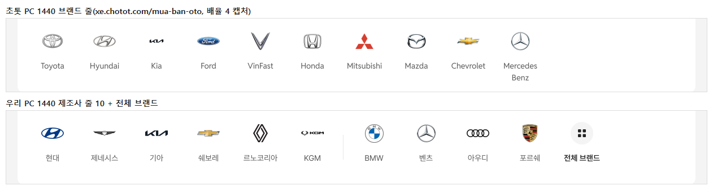
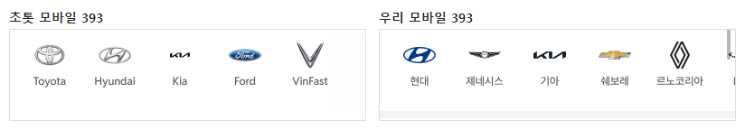
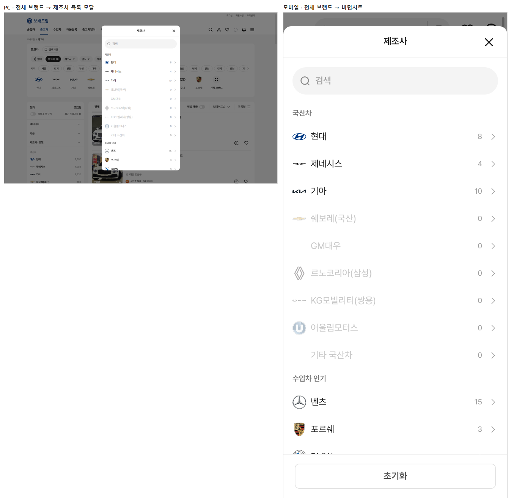

# PR #96 QF-108 퀵필터 제조사 줄을 초톳과 동일하게 — 10개 + 전체 브랜드 · 로고 크기 3단계 · 이름 폭 고정

## 1. 한 줄 요약
과쯔 제조사 줄을 월 단위 상위 10개(국산 6 │ 수입 4)와 "전체 브랜드" 1칸으로 바꿨습니다. 로고 크기는 비율에 따라 3단계(82.5% · 91% · 100%)로, 이름 글자 상자는 PC 76 · 모바일 56으로 고정했습니다. PC 1280·1440에서 11칸이 한 줄에 들어가고, 점검이 모두 통과해 병합·배포했습니다.

## 2. 기본 정보
| 항목 | 내용 |
|---|---|
| 과제 ID | QF-108(QF-109 병합·배포 뒤 이어서) |
| 브랜치 | `feat/qf-108-brand10`(QF-109가 병합된 main `cbeb70e`에서 시작) |
| 커밋 | `2bcf34b` · 보고서 커밋(이 파일) |
| PR | https://github.com/bobaekimboae/bobaedream/pull/96 |
| 상태 | 병합·배포(배포 v 값은 채팅 보고·노션에 적음) |
| 이번 병합으로 main에 함께 들어간 과제 | QF-108 |

## 3. 한 일
- **10개 목록**: `src/prototype/data/brand-top10.json`(기준 월 2026-09). 현대 · 제네시스 · 기아 · 쉐보레 · 르노코리아 · KGM │ BMW · 벤츠 · 아우디 · 포르쉐, 구분선 1×44 #E4E7EC. 국산차·수입차 유형으로 들어오면 그쪽만 보입니다. card 모양도 같은 칸 수입니다.
- **전체 브랜드(11번째 칸)**: 같은 칸 규격에 원형(PC 40 · 모바일 36, #F4F4F4)과 격자 아이콘, 이름 600 #222입니다. 누르면 "제조사 ▾" 칩과 같은 목록이 열립니다(PC 모달 · 모바일 바텀시트). 목록 순서는 국산차 → 수입차 인기 → 수입차 이름순이고, 로고 24 + 이름 + 매물 수, 0대는 흐리게 보입니다. 고르면 닫히고 그 브랜드의 모델 줄로 갑니다.
- **로고 크기 3단계**(`krPlainLogoSize`): 비율 1.25 이하는 긴 변 82.5%(33 · 29.7), 1.25 초과 1.6 미만은 폭 91%(36.4 · 32.8), 1.6 이상은 폭 100%(40 · 36)입니다.
- **이름 글자 상자**: PC 76 · 모바일 56 고정, 가운데, 최대 2줄 말줄임입니다.
- **점검**: 초톳 대조 `scripts/brand-rail-compare.mjs`(배율 4, 로고 그림 경계)를 추가했습니다. check:logos는 10+1 순서·11칸 한 줄·이름 폭 76·3단계 크기로 바꿨고, check:models는 줄에 없는 제조사를 "전체 브랜드" 목록에서 고르도록 바꿨습니다.
- **문서**: quick-filter-spec(QF-108), 매뉴얼 적용 현황, change-log CH-0107~0110.

## 4. 원본과 비교(초톳 xe.chotot.com/mua-ban-oto, 배율 4 · 로고 그림 경계)
### PC 1440
| # | 초톳 이름 | 초톳 칸 | 초톳 로고 그림(상자 대비) | 초톳 비율 | 우리 이름 | 우리 칸 | 우리 로고 그림(상자 대비) | 우리 비율(단계) | 우리 이름 상자 폭 |
|---:|---|---|---|---:|---|---|---|---|---:|
| 1 | Toyota | 84×102 | 36.5×25.5 (91.3%×63.8%) | 1.43 1.25~1.6 | 현대 | 84×102 | 40×20 (100%×50%) | 2 ≥1.6 | 76 |
| 2 | Hyundai | 84×102 | 39.5×21 (98.8%×52.5%) | 1.88 ≥1.6 | 제네시스 | 84×102 | 40×8 (100%×20%) | 4.969 ≥1.6 | 76 |
| 3 | Kia | 84×102 | 24.5×6 (61.3%×15%) | 4.08 ≥1.6 | 기아 | 84×102 | 40×10 (100%×25%) | 4.235 ≥1.6 | 76 |
| 4 | Ford | 84×102 | 40×15.5 (100%×38.8%) | 2.58 ≥1.6 | 쉐보레 | 84×102 | 40×12 (100%×30%) | 3.457 ≥1.6 | 76 |
| 5 | VinFast | 84×102 | 33.8×32.3 (84.5%×80.7%) | 1.05 ≤1.25 | 르노코리아 | 84×102 | 26×32 (65%×80%) | 0.76 ≤1.25 | 76 |
| 6 | Honda | 84×102 | 31.8×26.3 (79.5%×65.8%) | 1.21 ≤1.25 | KGM | 84×102 | 40×8 (100%×20%) | 5.182 ≥1.6 | 76 |
| 7 | Mitsubishi | 84×102 | 32×28.3 (80%×70.8%) | 1.13 ≤1.25 | BMW | 84×102 | 33×33 (82.5%×82.5%) | 1 ≤1.25 | 76 |
| 8 | Mazda | 84×102 | 33×26.5 (82.5%×66.3%) | 1.25 ≤1.25 | 벤츠 | 84×102 | 33×32 (82.5%×80%) | 1.021 ≤1.25 | 76 |
| 9 | Chevrolet | 84×102 | 40×13.5 (100%×33.8%) | 2.96 ≥1.6 | 아우디 | 84×102 | 40×14 (100%×35%) | 2.847 ≥1.6 | 76 |
| 10 | Mercedes Benz | 84×102 | 33×33 (82.5%×82.5%) | 1 ≤1.25 | 포르쉐 | 84×102 | 26×32 (65%×80%) | 0.781 ≤1.25 | 76 |
| 11 | - | - | - | - | 전체 브랜드 | 84×102 | 14×14 (35%×35%) | - | 76 |

### 모바일 393
| # | 초톳 이름 | 초톳 칸 | 초톳 로고 그림(상자 대비) | 초톳 비율 | 우리 이름 | 우리 칸 | 우리 로고 그림(상자 대비) | 우리 비율(단계) | 우리 이름 상자 폭 |
|---:|---|---|---|---:|---|---|---|---|---:|
| 1 | Toyota | 64×74 | 33×23 (91.7%×63.9%) | 1.43 1.25~1.6 | 현대 | 64×74 | 36×18 (100%×50%) | 2 ≥1.6 | 56 |
| 2 | Hyundai | 64×74 | 35.5×18.8 (98.6%×52.2%) | 1.89 ≥1.6 | 제네시스 | 64×74 | 36×8 (100%×22.2%) | 4.969 ≥1.6 | 56 |
| 3 | Kia | 64×74 | 22×5.5 (61.1%×15.3%) | 4 ≥1.6 | 기아 | 64×74 | 36×8 (100%×22.2%) | 4.235 ≥1.6 | 56 |
| 4 | Ford | 64×74 | 36×13.8 (100%×38.3%) | 2.61 ≥1.6 | 쉐보레 | 64×74 | 36×10 (100%×27.8%) | 3.457 ≥1.6 | 56 |
| 5 | VinFast | 64×74 | 30.3×28.8 (84.2%×80%) | 1.05 ≤1.25 | 르노코리아 | 64×74 | 22×30 (61.1%×83.3%) | 0.76 ≤1.25 | 56 |
| 6 | Honda | 64×74 | 28.8×23.8 (80%×66.1%) | 1.21 ≤1.25 | KGM | 64×74 | 36×6 (100%×16.7%) | 5.182 ≥1.6 | 56 |
| 7 | Mitsubishi | 64×74 | 29×25.3 (80.6%×70.3%) | 1.15 ≤1.25 | BMW | 64×74 | 30×30 (83.3%×83.3%) | 1 ≤1.25 | 56 |
| 8 | Mazda | 64×74 | 29.8×24 (82.8%×66.7%) | 1.24 ≤1.25 | 벤츠 | 64×74 | 30×30 (83.3%×83.3%) | 1.021 ≤1.25 | 56 |
| 9 | Chevrolet | 64×74 | 36×12 (100%×33.3%) | 3 ≥1.6 | 아우디 | 64×74 | 36×12 (100%×33.3%) | 2.847 ≥1.6 | 56 |
| 10 | Mercedes Benz | 64×74 | 29.5×29.8 (81.9%×82.8%) | 0.99 ≤1.25 | 포르쉐 | 64×74 | 24×30 (66.7%×83.3%) | 0.781 ≤1.25 | 56 |
| 11 | - | - | - | - | 전체 브랜드 | 64×74 | 13×13 (36.1%×36.1%) | - | 56 |

- 로고 크기 3단계는 초톳 실측과 맞습니다. 1.25~1.6 구간은 Toyota 1.43 → 91.3%로 우리 91%와 같습니다. 1.25 이하는 초톳 80~84.5%, 우리 82.5%입니다. 1.6 이상은 초톳 98.6~100%, 우리 100%입니다(초톳 Kia는 파일 안에 여백이 있어 61%).
- 칸 84×102 · 64×74, 피치 92 · 72는 초톳과 같습니다. 초톳은 로고가 10칸이고, 이번 측정 페이지에서는 "전체 브랜드" 칸이 보이지 않았습니다(지시대로 11번째 칸을 둠).

## 5. 검증
| 점검 | 결과 |
|---|---|
| 전체 브랜드 열기·고르기·닫기 | PC·모바일: 열림(국산차 · 수입차 인기 · 수입차 이름순, 94행, 로고 24×24, 0대 #C8C8C8) → 페라리 → 닫힘 → "페라리 모델" 줄 · 칩 [페라리 ×] |
| 제조사 칩 | 같은 목록(94행) |
| PC 11칸 한 줄 | 1440: 마지막 칸 오른쪽 1161 ≤ 줄 1320 · 1280: 1081 ≤ 1240, 가로 넘침 0 |
| `check:logos` | 23/23 |
| `check:stability` | plain·card × 4개 크기 모두 통과 |
| `check:models` | 23/23 · 23/23 · 19/19 |
| `check:top` · `check:hybrid` · `check:sidebar` · `check:model-images` | 21/21 · 20/20 · 31/31 · 15/15 |
| `verify:qf` | 통과 |
| `regress:modes` | 초톳·동처띠 0%(과쯔도 0%) |
| `diff:bbm` · `diff:bbm:flow` | 모든 영역 3% 이하 |
| 콘솔 오류 | PC 0 · 모바일 0 |

## 6. 지시와 다르게 남긴 것과 이유
- **전체 브랜드 창**: "PC 펼침판"은 제조사 칩이 여는 기존 PC 모달과 같은 창으로 두었습니다(지시의 "필터 칩 '제조사 ▾'도 같은 목록을 연다"를 우선).
- **샘플 0대 브랜드**: 쉐보레·르노코리아·KGM은 화면 샘플 매물이 0대라 눌러도 목록이 비어 보입니다. 10개 목록은 월 단위로 고정이라 그대로 두었습니다.
- **모델 데이터가 없는 브랜드**(예 랜드로버): 전체 브랜드에서 고르면 창은 닫히지만, 모델 데이터가 없어 기존 규칙대로 제조사 줄에 머뭅니다.
- **PC 1024~1279**: 1100 폭(카드 1052)에서는 11칸이 겨우 들어가는 폭이라 점검 대상(1280·1440)에서 뺐습니다.

## 7. 못 한 것 · 다음에 할 것
- brand-top10.json은 월이 바뀔 때 손으로 갱신합니다(매물 수 상위 10 산출 자동화는 아직 없음).

## 8. 확인 링크
- 모바일: https://bobaekimboae.github.io/bobaedream/?qf=guazi&v=<커밋>
- PC: https://bobaekimboae.github.io/bobaedream/?qf=guazi&v=<커밋>&pc=1
