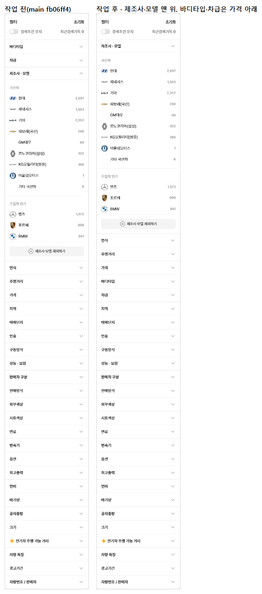

# PR #97 QF-110 PC 좌측 필터 순서 변경 — 제조사·모델 맨 위, 바디타입·차급은 가격 아래

## 1. 한 줄 요약
과쯔 모드 PC 좌측 필터 순서를 "제조사·모델 → 연식 → 주행거리 → 가격 → 바디타입 → 차급 → 지역 …"으로 바꿨습니다. 순서는 설정 배열 하나(`bbmFilterOrder`)에서 정의하고, 과쯔에만 적용했습니다. 점검이 모두 통과해 병합·배포했습니다.

## 2. 기본 정보
| 항목 | 내용 |
|---|---|
| 과제 ID | QF-110 |
| 브랜치 | `feat/qf-110-sidebar-order`(main `fb06ff4`에서 시작) |
| 커밋 | `ae4ed3e` · 보고서 커밋(이 파일) |
| PR | https://github.com/bobaekimboae/bobaedream/pull/97 |
| 상태 | 병합·배포(배포 v 값은 채팅 보고·노션에 적음) |
| 이번 병합으로 main에 함께 들어간 과제 | QF-110 |

## 3. 한 일
- `src/prototype/filters/bbm-filter-options.ts`에 `bbmFilterOrder`를 두었습니다. 순서는 제조사 · 모델 → 연식 → 주행거리 → 가격 → 바디타입 → 차급 → 지역 아래 기존 순서입니다. 나중에 모바일 시트도 이 배열을 쓸 수 있습니다.
- `BbFilterSidebar`에 `order`를 받게 했습니다. 과쯔(PC 좌측 필터와 1024~1279 펼침판)만 새 순서를 넘기고, 초톳·동처띠 PC는 원래 순서 그대로입니다. 처음에 공통으로 바꿨다가 regress:modes에서 초톳·동처띠 PC가 0.82% 달라진 것을 보고 과쯔 한정으로 고쳤습니다.
- 항목 내용·동작·펼침 규칙·선택 상태는 그대로입니다. 제조사·모델은 처음부터 펼쳐져 있고, 바디타입·차급은 접혀 있습니다. 필터 머리(필터 · 초기화 · 검색조건 유지 · 최근검색기록)는 맨 위 그대로입니다. 모바일 필터 바텀시트는 바꾸지 않았습니다.
- 점검: check:sidebar에 순서 항목을 추가했고(31 → 33), 순서·y 측정 `scripts/sidebar-order-measure.mjs`를 만들었습니다.
- diff:bbm 기준(QF-106b) 가운데 좌측 필터 두 조각(pc-1-first · pc-2-bodytype sidebar)만 새로 저장했습니다. 순서를 바꾼 의도된 차이로, 갱신 전 차이는 8.1% · 5.9%였습니다. 원본 보관본은 덮어쓰지 않도록 부품을 고쳤습니다.

## 4. 원본과 비교 — 좌측 필터 제목 순서와 y 위치(좌측 필터 위 기준, 앞 10개)
| # | 1440 전 | 1440 후 | 1280 전 | 1280 후 |
|---:|---|---|---|---|
| 1 | 바디타입 @95 | 제조사 · 모델 @95 (펼침) | 바디타입 @95 | 제조사 · 모델 @95 (펼침) |
| 2 | 차급 @144 | 연식 @790 | 차급 @144 | 연식 @790 |
| 3 | 제조사 · 모델 @193 (펼침) | 주행거리 @839 | 제조사 · 모델 @193 (펼침) | 주행거리 @839 |
| 4 | 연식 @888 | 가격 @888 | 연식 @888 | 가격 @888 |
| 5 | 주행거리 @937 | 바디타입 @937 | 주행거리 @937 | 바디타입 @937 |
| 6 | 가격 @986 | 차급 @986 | 가격 @986 | 차급 @986 |
| 7 | 지역 @1035 | 지역 @1035 | 지역 @1035 | 지역 @1035 |
| 8 | 매매단지 @1084 | 매매단지 @1084 | 매매단지 @1084 | 매매단지 @1084 |
| 9 | 인승 @1133 | 인승 @1133 | 인승 @1133 | 인승 @1133 |
| 10 | 구동방식 @1182 | 구동방식 @1182 | 구동방식 @1182 | 구동방식 @1182 |

- 11번째부터(인승 → 구동방식 → … → 차량번호 / 판매자)는 전후 순서와 위치가 같습니다. 항목은 27개 그대로이고, "지역 아래 순서가 같음"도 확인했습니다.

## 5. 검증
| 점검 | 결과 |
|---|---|
| 벤츠 선택(좌측 필터 제조사·모델) | 1440·1280 모두 칩 [중고차][벤츠 ×], ④ "벤츠 모델" 줄, 경로 "보배드림/중고차/벤츠" |
| 바디타입 펼쳐 SUV | 펼침 → 칩 [SUV ×] 반영 |
| 차급 펼침 | 펼쳐짐(선택지 5개). 샘플 매물 기준 모두 0대라 비활성 — 순서 변경 전과 같은 상태 |
| sticky·스크롤 | 좌측 필터 position sticky, check:sidebar 33/33(아래 붙는 사이드바·접었을 때 위 16 포함) |
| `check:stability` · `check:logos` · `check:models` · `check:model-images` · `check:top` · `check:hybrid` | 전부 · 23/23 · 23/23·23/23·19/19 · 15/15 · 21/21 · 20/20 |
| `verify:qf` | 통과 |
| `regress:modes` | 초톳·동처띠 PC·모바일 10개 0% |
| `diff:bbm` · `diff:bbm:flow` | 새 기준 대비 0% · flow 최대 0.8% |
| 콘솔 오류 | 0 |

## 6. 지시와 다르게 남긴 것과 이유
- 1024~1279 폭의 "필터" 펼침판도 같은 좌측 필터 부품이라 새 순서가 적용됩니다(과쯔 PC 좌측 필터 범위로 봄).
- 차급은 샘플 매물이 모두 0대라 "펼쳐 선택 → 칩 반영"은 바디타입(SUV)으로 확인했습니다.

## 7. 못 한 것 · 다음에 할 것
- 모바일 필터 바텀시트 순서 통일(`bbmFilterOrder` 사용)은 다음 지시에서.

## 8. 확인 링크
- PC: https://bobaekimboae.github.io/bobaedream/?qf=guazi&v=<커밋>&pc=1
- 모바일: https://bobaekimboae.github.io/bobaedream/?qf=guazi&v=<커밋>
