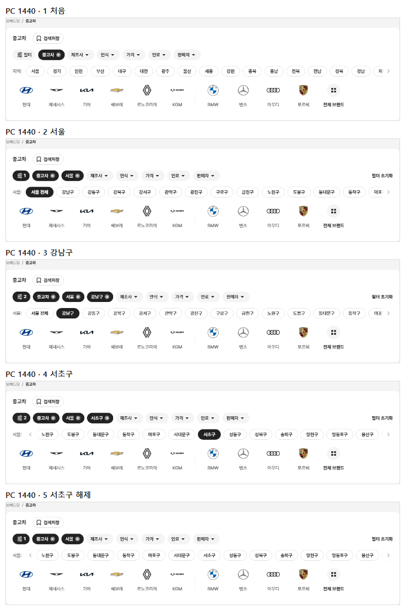
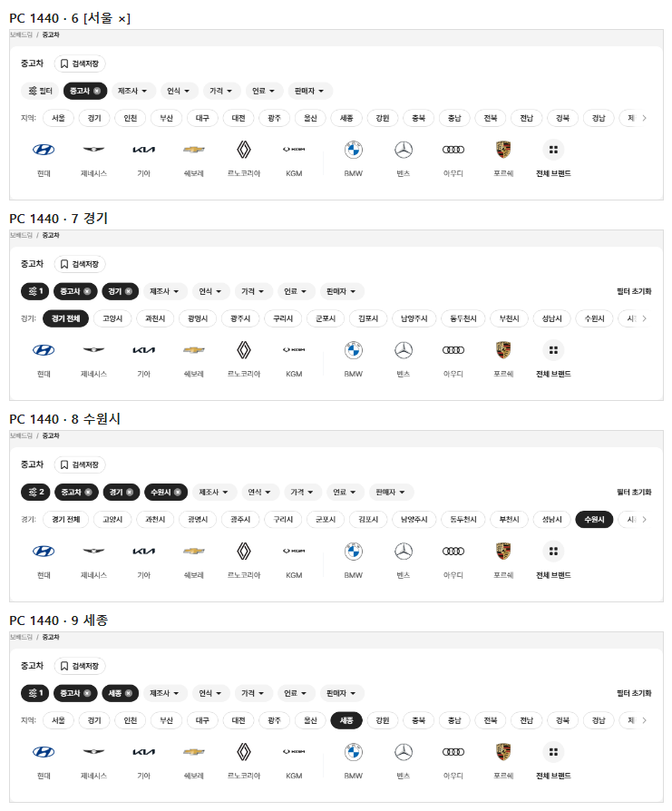
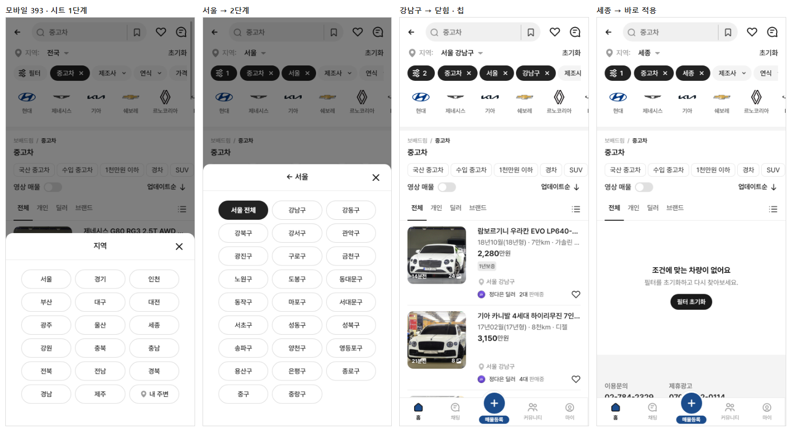
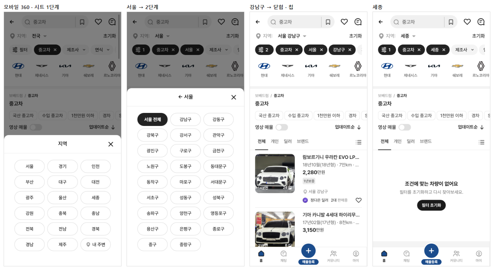

# PR #98 QF-111 지역 칩 시도 → 구·군(PC 칩 줄 + 모바일 바텀시트)

## 1. 한 줄 요약
과쯔 지역 선택을 시도 → 구·군 두 단계로 바꿨습니다. PC는 지역 칩 줄의 같은 자리가 구·군 알약 줄로 바뀌고(줄 높이 32 · 카드 높이 282 불변), 모바일은 "지역: 전국 ▾" 바텀시트가 2단계가 됐습니다. 매물 목록도 고른 시도·구·군으로 걸러지고, 점검이 모두 통과해 병합·배포했습니다.

## 2. 기본 정보
| 항목 | 내용 |
|---|---|
| 과제 ID | QF-111(QF-111 → QF-113 → QF-114 중 첫째) |
| 브랜치 | `feat/qf-111-region-drill`(main `d04f557`에서 시작) |
| 커밋 | `9426fa5` · 보고서 커밋(이 파일) |
| PR | https://github.com/bobaekimboae/bobaedream/pull/98 |
| 상태 | 병합·배포(배포 v 값은 채팅 보고·노션에 적음) |
| 이번 병합으로 main에 함께 들어간 과제 | QF-111 |

## 3. 한 일
- **데이터**: `src/prototype/data/regions-kr.json`에 시도 17과 시·군·구 228을 넣었습니다(기준 시안과 같은 목록, 세종 없음). 광역·특별시는 가나다순, 도는 시(가나다) → 군(가나다) 순서입니다.
- **필터 값**: 개발 시안형 필터에 `district`를 추가했습니다. 값은 "서울 강남구"처럼 시도를 포함해 중구·서구 같은 이름 겹침을 막습니다. 매물 `place`의 앞 두 단어로 거르고, 칩에는 [강남구 ×]로 보입니다. [서울 ×]를 누르면 그 시도의 구·군까지 함께 풀립니다. "필터 N"에는 시도·구·군이 각각 들어갑니다.
- **PC 지역 줄**: 처음에는 "지역:" + 시도 17 + 내 주변입니다. 시도를 누르면 칩 [서울 ×]가 붙고, 같은 자리가 "서울:" + "서울 전체"(선택, 700) + 구·군으로 바뀝니다. 구·군을 누르면 [강남구 ×]가 붙고 줄은 유지되며, 하나만 고를 수 있습니다. 같은 구·군이나 "서울 전체"를 누르면 해제됩니다. 세종은 시도 줄에 머뭅니다.
- **모바일 바텀시트**(칩 줄은 추가하지 않음): 1단계는 시도 17 + 내 주변(3열, 높이 40)입니다. 서울을 누르면 "← 서울" 2단계가 됩니다("서울 전체" 선택 + 구·군 3열, ←를 누르면 1단계). 구·군을 누르면 시트가 닫히고, 칩 [서울 ×][강남구 ×]와 "지역: 서울 강남구"가 보입니다. 세종은 바로 적용하고 닫힙니다. 시트 머리의 ← 때문에 `BbmSheet`에 선택 항목 `onBack`을 추가했습니다.
- **점검**: `scripts/region-flow-check.mjs`를 추가했고, `check:stability`에 지역 단계(PC 서울 → 강남구, 모바일 시트 서울 → 강남구)를 넣었습니다. quick-filter-spec과 change-log CH-0112~0114도 갱신했습니다.

## 4. 원본과 비교 — PC 흐름 단계별(1440 · 카드 높이는 1440 / 1280)
| # | 단계 | 적용 칩 | 지역 줄(이름표 · 선택) | 줄 높이 | 카드 높이 | 필터 N | 매물 수 |
|---:|---|---|---|---:|---|---|---:|
| 1 | 처음 | 중고차 | 지역:  | 32 | 282 / 282 | 필터 | 64 |
| 2 | 서울 | 중고차 · 서울 | 서울: 서울 전체 | 32 | 282 / 282 | 1 | 19 |
| 3 | 강남구 | 중고차 · 서울 · 강남구 | 서울: 강남구 | 32 | 282 / 282 | 2 | 9 |
| 4 | 서초구 | 중고차 · 서울 · 서초구 | 서울: 서초구 | 32 | 282 / 282 | 2 | 4 |
| 5 | 서초구 해제 | 중고차 · 서울 | 서울: 서울 전체 | 32 | 282 / 282 | 1 | 19 |
| 6 | [서울 ×] | 중고차 | 지역:  | 32 | 282 / 282 | 필터 | 64 |
| 7 | 경기 | 중고차 · 경기 | 경기: 경기 전체 | 32 | 282 / 282 | 1 | 8 |
| 8 | 수원시 | 중고차 · 경기 · 수원시 | 경기: 수원시 | 32 | 282 / 282 | 2 | 3 |
| 9 | 세종 | 중고차 · 세종 | 지역: 세종 | 32 | 282 / 282 | 1 | 0 (0대 안내) |
| 10 | 강남구 + 벤츠 | 중고차 · 벤츠 · 서울 · 강남구 | 서울: 강남구 | 32 | 282 / 282 | 3 | 3 |
| 11 | 벤츠 ×(지역 유지) | 중고차 · 서울 · 강남구 | 서울: 강남구 | 32 | 282 / 282 | 2 | 9 |

- 1280도 모든 단계가 같은 결과입니다(점검 11개 통과, 콘솔 오류 0).

## 5. 검증
| 점검 | 결과 |
|---|---|
| `region-flow-check`(새) | PC 1440·1280 각 11개 · 모바일 393·360 각 7개 모두 통과 |
| 필터 초기화 | 처음으로(지역 줄 "지역:", 칩 [중고차]만, 제조사 줄) |
| `check:stability` | plain·card × 4개 크기 + 지역 단계 모두 통과 |
| `check:sidebar` · `check:logos` · `check:model-images` · `check:top` · `check:hybrid` | 33/33 · 23/23 · 15/15 · 21/21 · 20/20 |
| `check:models` | 23/23 · 23/23 · 19/19(pc-1440·m-393은 한 번 중간에 멈춰 다시 돌려 통과 — 메모리 부족 추정) |
| `verify:qf` | 통과 |
| `regress:modes` | 전 모드 0% |
| `diff:bbm` · `diff:bbm:flow` | 3% 이하 |
| 콘솔 오류 | 0 |

## 6. 지시와 다르게 남긴 것과 이유
- 모바일은 이전 지역 시트(시·도 드롭다운·반경) 대신, 과쯔 모드에서는 새 2단계 시트를 씁니다. 지역 값도 PC와 같은 필터 값(region · district)을 씁니다. 초톳·동처띠의 지역 시트는 그대로입니다.
- 샘플 매물에는 세종이 없어 세종을 고르면 "조건에 맞는 차량이 없어요"(0대 안내)가 나옵니다.

## 7. 못 한 것 · 다음에 할 것
- "필터 N" 칩이 조건이 있으면 숫자만 보이는 문제는 다음 과제 QF-113(T2)에서 고칩니다.

## 8. 확인 링크
- PC: https://bobaekimboae.github.io/bobaedream/?qf=guazi&v=<커밋>&pc=1
- 모바일: https://bobaekimboae.github.io/bobaedream/?qf=guazi&v=<커밋>
