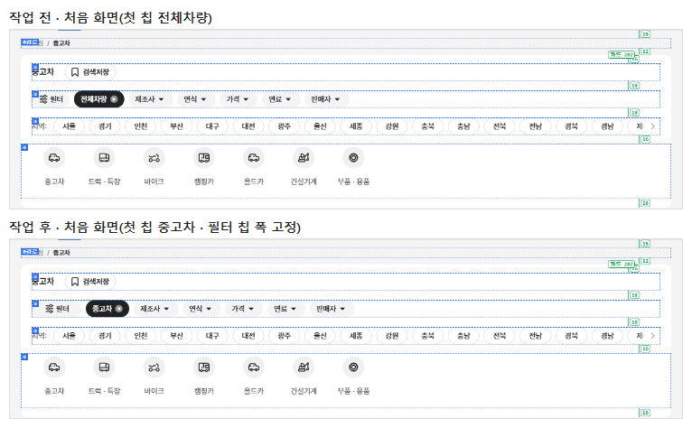
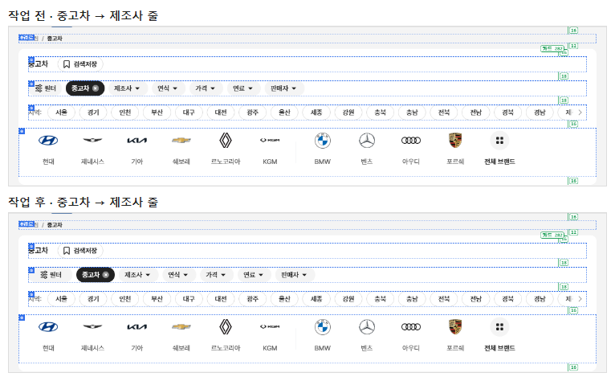
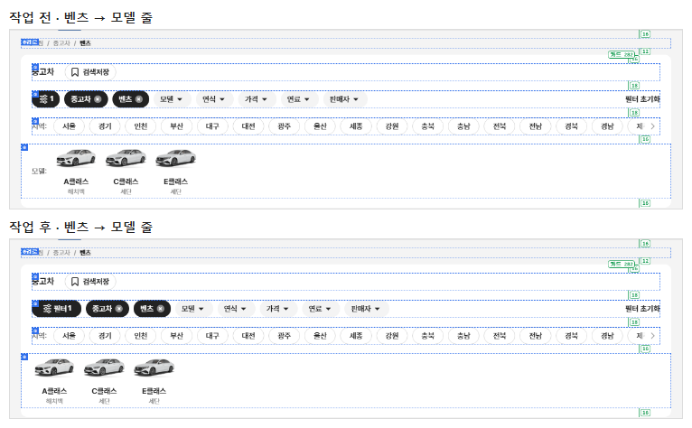
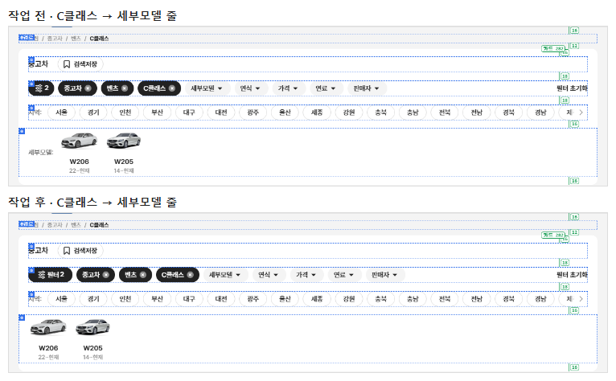
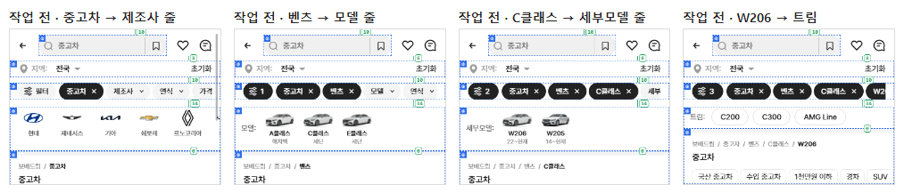
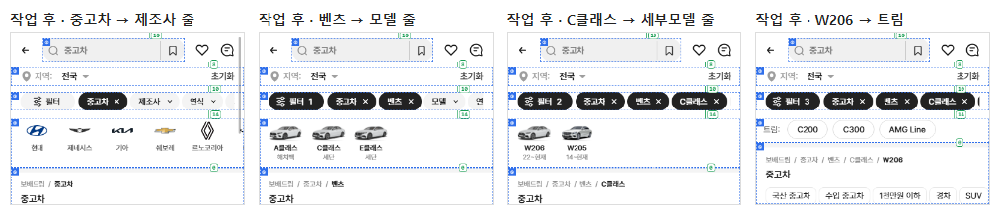

# PR #99 QF-113 퀵필터 선택 시 틀어짐 잡기

## 1. 한 줄 요약
퀵필터를 고를 때 줄이 옆으로 틀어지던 문제를 잡았습니다. 이미지 줄(제조사·모델·세부모델)의 이름표를 없애 첫 칸이 모든 단계에서 같은 x에 오고, "필터" 칩은 글자를 유지한 채 폭을 고정해 옆 칩이 밀리지 않습니다. 처음 칩 이름은 "중고차"로 바꾸고, 유형을 고르면 제목이 그 유형 이름이 됩니다. 자동 점검을 추가했고 모두 통과해 병합·배포했습니다.

## 2. 기본 정보
| 항목 | 내용 |
|---|---|
| 과제 ID | QF-113(QF-111 병합·배포 뒤) |
| 브랜치 | `feat/qf-113-qf-align`(QF-111이 병합된 main `ac0e355`에서 시작) |
| 커밋 | `2b51be2` · 보고서 커밋(이 파일) |
| PR | https://github.com/bobaekimboae/bobaedream/pull/99 |
| 상태 | 병합·배포(배포 v 값은 채팅 보고·노션에 적음) |
| 이번 병합으로 main에 함께 들어간 과제 | QF-113 |

## 3. 한 일
- **T1 이미지 줄 이름표 제거**: 모델·세부모델 줄의 "모델:" "세부모델:"을 없앴습니다(`.depth-rail.no-label`, `qf-align.css`). 첫 칸 x는 PC에서 첫 칩 x, 모바일에서 첫 칩 − 4입니다. 이름표("트림:" "연식:" "지역:")는 알약 줄에만 남습니다.
- **T2 "필터" 칩**: 조건이 없으면 "필터", 있으면 "필터 N"으로 글자를 유지하고(#222), 폭을 92로 고정했습니다(PC·모바일).
- **T3 첫 칩 이름**: 처음 화면의 "전체차량"을 "중고차"로 바꿨습니다(과쯔만, 경로에도 "전체차량" 단계 없음). 다른 모드는 "전체차량" 그대로입니다. 처음에는 공통 코드에 적용해 초톳·동처띠 PC가 0.15% 달라졌고, 과쯔 한정으로 고쳐 0%가 됐습니다.
- **T6 제목**: 유형을 고르면 제목이 그 유형 이름이 됩니다("트럭 · 특장" · "바이크" · "캠핑카" · "올드카" · "건설기계" · "부품 · 용품"). 중고차는 "중고차"이고, 조건 칩은 제목을 바꾸지 않습니다.
- **자동 점검**(check:stability): 처음 → 벤츠 → C클래스 → W206 → C200 흐름에서 세 가지를 봅니다. ① 이미지 줄 첫 칸 x가 모두 같고 이름표가 없는지, ② "필터" 다음 칩 x가 같은지, ③ 이미지 줄 칸 위 끝과 이미지 영역 바닥이 같은지입니다. check:models의 줄 이름 판정도 이름표 없음에 맞췄습니다.
- **원본 대조 기준 갱신**: 모바일 칩 줄 두 상태(m-1 · m-7, 필터 칩 폭·첫 칩 이름)와 flow 전체를 다시 저장했습니다. flow에 남아 있던 "파랑 제목" 불일치 6건은 QF-110 좌측 필터 순서 변경 때문이라 함께 반영했습니다(갱신 뒤 274/274). 원본 보관본은 그대로입니다.
- **문서**: 매뉴얼 v1.5(이미지 줄 이름표 없음 · 필터 칩 글자 유지 · 폭 92 · 유형 제목), quick-filter-spec, change-log CH-0115~0118.

## 4. 원본과 비교 — 정렬 점검 수치(처음 → 벤츠 → C클래스 → W206 → C200)
| 크기 | ① 이미지 줄 첫 칸 x | ② "필터" 다음 칩 x | ③ 칸 위 끝 · 이미지 영역 바닥 | 필터 칩 글자 |
|---|---|---|---|---|
| PC 1440 전 | 140 / 179.8 / 204 (최대 64 틀어짐) | 218.2 / 200.4 / 202.4 / 202.9 / 203 | 0 · 46 | 필터 → 1 → 2 → 3 → 4 |
| PC 1440 후 | **140 / 140 / 140** | **240 고정** | 0 · 46 | 필터 → 필터1 → 필터2 → 필터3 → 필터4 |
| PC 1280 전 | 60 / 99.8 / 124 | 138.2 / 120.4 / 122.4 / 122.9 / 123 | 0 · 46 | 필터 → 1 → … |
| PC 1280 후 | **60 고정** | **160 고정** | 0 · 46 | 필터 → 필터1 → … |
| 모바일 393·360 전 | 12 / 51.8 / 76 | 92.2 / 77.3 / 79.3 / 79.8 / 79.9 | 2 · 36 | 필터 → 1 → … |
| 모바일 393·360 후 | **12 고정(첫 칩 16 − 4)** | **114 고정** | 2 · 36 | 필터 → 필터1 → … |

(card 모양도 같은 결과: 첫 칸 x 같음 · 다음 칩 x 고정 · 칸 위 0 · 영역 바닥 36)

## 5. 검증
| 점검 | 결과 |
|---|---|
| `check:stability` | plain·card × 4개 크기 + 정렬 ①②③ + 지역 단계 모두 통과 |
| `check:models` | 23/23 · 23/23 · 19/19(세부모델 줄 이름표 없음 항목 포함) |
| `check:sidebar` · `check:logos` · `check:model-images` · `check:top` · `check:hybrid` · 지역 흐름 | 33/33 · 23/23 · 15/15 · 21/21 · 20/20 · 전부 |
| `verify:qf` | 통과 |
| `regress:modes` | 초톳·동처띠 0%(과쯔 모바일 0.78%는 이번 변경) |
| `diff:bbm` · `diff:bbm:flow` | 갱신한 기준 대비 0% · flow 274/274 |
| 콘솔 오류 | 0 |

## 6. 지시와 다르게 남긴 것과 이유
- "필터" 칩은 "최소 폭 고정"을 고정 폭 92(두 자리 수까지)로 구현했습니다. 조건이 없을 때는 글자가 가운데에 옵니다.
- 원본 대조 기준 갱신 범위: 모바일 칩 줄 2상태 + flow 전체. flow의 바뀐 곳은 모바일 칩 줄(29~32%)과 QF-110 순서("파랑 제목")뿐임을 확인하고 저장했습니다.

## 7. 못 한 것 · 다음에 할 것
- 다음 과제 QF-114(바이크·트럭 제조사 줄)를 이어서 진행합니다.

## 8. 확인 링크
- PC: https://bobaekimboae.github.io/bobaedream/?qf=guazi&v=<커밋>&pc=1&debug=1
- 모바일: https://bobaekimboae.github.io/bobaedream/?qf=guazi&v=<커밋>&debug=1
